  <!-- Banner -->
  

    

  <!-- Name -->
  <h1>Bablu Kumar</h1>

  <!-- Title / Typing Animation -->
  

   

  <!-- Tagline -->
  
<i>"Building real-world applications that solve real problems."</i>

   

  <!-- Social Badges -->
  

    
    
    
    
    
  

   

  <!-- Stats -->
  

    
    
    
  

   

  <!-- Resume Button -->
  

---

## ⚡ About Me

I'm **Bablu Kumar**, a passionate **Full-Stack Developer (MERN)** and **Machine Learning Enthusiast** who loves building scalable and impactful applications.

I focus on combining **data + development + problem-solving** to create solutions that are efficient, user-friendly, and real-world ready.

- 🔭 **Currently Working On:** Full-stack architecture & ML-powered applications
- 🌱 **Learning:** Next.js, System Design, Advanced ML algorithms
- ⚡ **Philosophy:** *"Consistency beats talent."*
- 🎯 **Goal:** Engineer scalable software systems as a **Software Engineer / ML Engineer**

---

## 🛠️ Tech Stack

  <h3>💻 Languages</h3>
  
  
  
  
  <h3>🌐 Frontend</h3>
  
  
  
  
  
  <h3>⚙️ Backend</h3>
  
  
  
  <h3>🗄️ Database</h3>
  
  
  
  <h3>📊 Machine Learning</h3>
  
  
  
  
  
  

  <h3>☁️ Tools</h3>
  
  
  
  
  

---

## 🔬 Featured Projects

<table>
  <tr>
    <td width="35%"><strong>📚 Library Management System</strong></td>
    <td width="65%">
      Architected a <strong>Full-Stack MERN</strong> application featuring robust role-based authentication (JWT) for Admin and User roles. Designed a scalable REST API allowing complete CRUD operations layered beneath a modern, interactive UI layout.
        
      <i>#React #Node.js #MongoDB #Express #TailwindCSS</i>
    </td>
  </tr>
  <tr>
    <td width="35%"><strong>💰 Medical Insurance Cost Prediction</strong></td>
    <td width="65%">
      Engineered an end-to-end Machine Learning pipeline utilizing <strong>Scikit-learn & XGBoost</strong> to forecast predictive models (Linear Regression, Random Forest). Successfully deployed an interactive web service via <strong>Streamlit</strong>.
        
      <i>#Python #MachineLearning #XGBoost #Streamlit</i>
    </td>
  </tr>
  <tr>
    <td width="35%"><strong>📊 Electric Vehicle Data Analysis</strong></td>
    <td width="65%">
      Executed comprehensive Exploratory Data Analysis (EDA) leveraging <strong>Pandas</strong> and cutting-edge visualization libraries to identify crucial adoption trends and insights.
        
      <i>#Pandas #EDA #DataAnalysis #Matplotlib</i>
    </td>
  </tr>
  <tr>
    <td width="35%"><strong>💧 Water Pollution & Disease Analysis</strong></td>
    <td width="65%">
      Developed a data-driven framework linking environmental pollution and corresponding health impact indices. Created high-impact visualizations empowering practical domain insights.
        
      <i>#DataScience #Visualization #DataAnalytics</i>
    </td>
  </tr>
</table>

---

## 📈 GitHub Analytics

  

 

## 🐍 Contribution Snake

  <picture>
    <source media="(prefers-color-scheme: dark)" srcset="https://raw.githubusercontent.com/Bablukumar2005/Bablukumar2005/output/github-contribution-grid-snake-dark.svg">
    <source media="(prefers-color-scheme: light)" srcset="https://raw.githubusercontent.com/Bablukumar2005/Bablukumar2005/output/github-contribution-grid-snake.svg">
    
  </picture>

 

## 📊 GitHub Stats

  
  

 

---

## ⚡ Recent Activity

<!--START_SECTION:activity-->
1. ❗ Opened issue [#1](https://github.com/Bablukumar2005/Bablukumar2005/issues/1) in [Bablukumar2005/Bablukumar2005](https://github.com/Bablukumar2005/Bablukumar2005)
<!--END_SECTION:activity-->

 

---

## 🏅 Coding Profiles & Activity

  
  
  

---

  <h3><i>Let’s build something impactful 🚀</i></h3>

